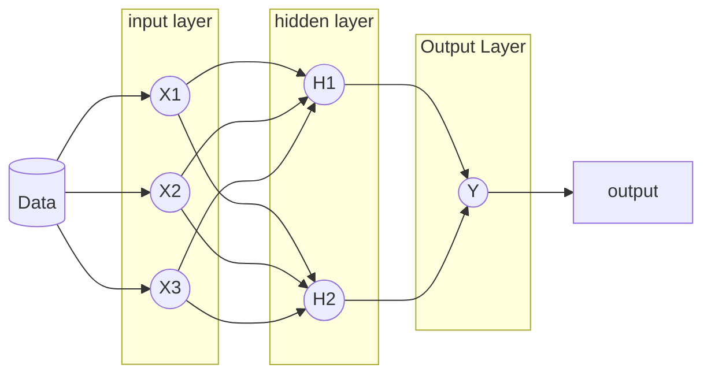

### Neural network

## Multi Layer Perceptron

Multi layer perception adalah salah satu jenis neural network yang paling umum digunakan. Multi layer perception terdiri dari 3 layer, yaitu input layer, hidden layer, dan output layer. Input layer merupakan layer pertama yang menerima input dari data. Hidden layer merupakan layer yang berada di tengah-tengah antara input layer dan output layer. Output layer merupakan layer terakhir yang menghasilkan output dari data.
Yang perlu diperhatikan adalah setiap _node_ dalam dsatu lapisan akan tersambung secara penuh ke semua node di lapisan berikutnya. Informasi yang mengalir dalam satu arah yaitu dari kiri ke kanan yang disebut dengan jaringan **_feedforward_**. Hubungan antara _node_ juga akan diberikan angka bobot masing-masing yang menentukan seberapa penting _feature_ yang bersangkutan.
Jika ada 10 feature maka akan ada 10 input node.

Multi Layer Perceptron:

Jumlah _Hiden Layer_ bergantung pada seberapa kopmleks pembelajaran yang mau ditentukan. Semakin kompleks pembelajaran maka semakin banyak _hidden layer_ yang dibutuhkan. Jumlah _hidden layer_ juga bergantung pada jumlah _node_ yang ada di dalamnya. Semakin banyak _node_ maka semakin kompleks pembelajaran yang bisa dilakukan. Jumlah _node_ juga bergantung pada jumlah _feature_ yang ada. Semakin banyak _feature_ maka semakin banyak _node_ yang dibutuhkan. Jumlah _node_ juga bergantung pada jumlah _output_ yang diinginkan. Semakin banyak _output_ yang diinginkan maka semakin banyak _node_ yang dibutuhkan.

> Deep Learning menggunakan Multi Layer Perceptron dengan jumlah _hidden layer_ yang sangat banyak. Jumlah _hidden layer_ yang banyak akan membuat pembelajaran menjadi lebih kompleks. Semakin kompleks pembelajaran maka semakin baik hasil prediksi yang dihasilkan.

#### Cara Membangun Model MLP

MLP adalah metode _supervised learning_ oleh sebab itu membutuhkan label di _training dataset_. Langkah selanjutnyta adalah melakukan _training_ dengan mekanisme interatif yang disebut dengan **_backpropagation_**.  