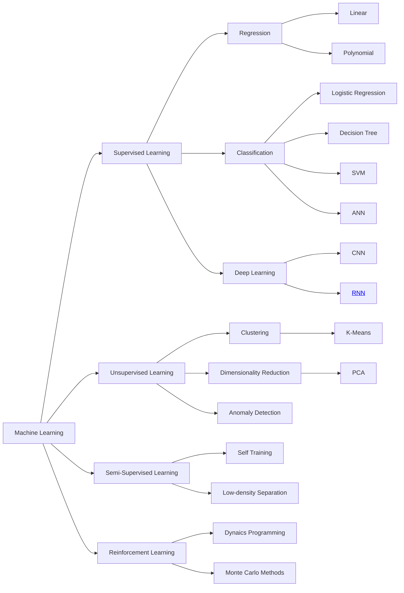

```mermaid
graph LR
A[Machine Learning] --> B[Supervised Learning]
A --> C[Unsupervised Learning]
A --> D[Reinforcement Learning]
A --> E[Semi-Supervised Learning]

B --> F[Regression]
B --> G[Classification]
B --> H[Deep Learning]

F --> I[Linear]
F --> J[Polynomial]

G --> K[Logistic Regression]
G --> L[Decision Tree]
G --> M[SVM]
G --> N[ANN]

H --> O[CNN]
H --> P[<a href='#'>RNN</a>]

C --> Q[Clustering]
Q --> R[K-Means]
C --> U[Dimensionality Reduction]
U --> T[PCA]
C --> S[Anomaly Detection]

E --> V[Self Training]
E --> W[Low-density Separation]

D --> X[Dynaics Programming]
D --> Y[Monte Carlo Methods]
```
