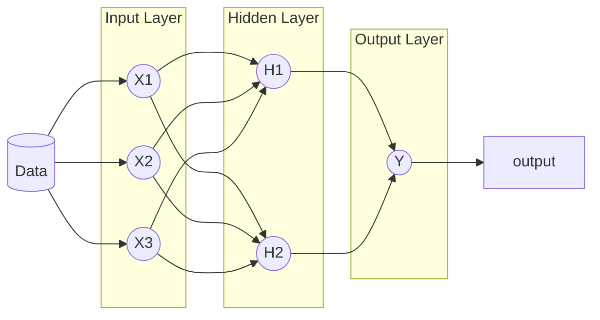
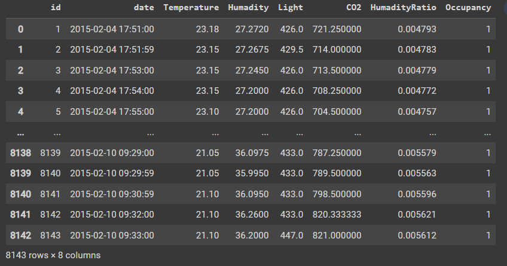
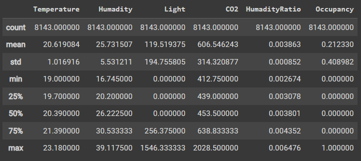
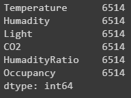
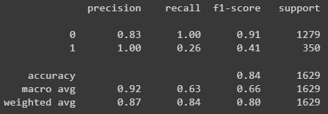

### Neural network

## Multi Layer Perceptron

Multi layer perception adalah salah satu jenis neural network yang paling umum digunakan. Multi layer perception terdiri dari 3 layer, yaitu input layer, hidden layer, dan output layer. Input layer merupakan layer pertama yang menerima input dari data. Hidden layer merupakan layer yang berada di tengah-tengah antara input layer dan output layer. Output layer merupakan layer terakhir yang menghasilkan output dari data.
Yang perlu diperhatikan adalah setiap _node_ dalam dsatu lapisan akan tersambung secara penuh ke semua node di lapisan berikutnya. Informasi yang mengalir dalam satu arah yaitu dari kiri ke kanan yang disebut dengan jaringan **_feedforward_**. Hubungan antara _node_ juga akan diberikan angka bobot masing-masing yang menentukan seberapa penting _feature_ yang bersangkutan.
Jika ada 10 feature maka akan ada 10 input node.

Multi Layer Perceptron:



Jumlah _Hiden Layer_ bergantung pada seberapa kopmleks pembelajaran yang mau ditentukan. Semakin kompleks pembelajaran maka semakin banyak _hidden layer_ yang dibutuhkan. Jumlah _hidden layer_ juga bergantung pada jumlah _node_ yang ada di dalamnya. Semakin banyak _node_ maka semakin kompleks pembelajaran yang bisa dilakukan. Jumlah _node_ juga bergantung pada jumlah _feature_ yang ada. Semakin banyak _feature_ maka semakin banyak _node_ yang dibutuhkan. Jumlah _node_ juga bergantung pada jumlah _output_ yang diinginkan. Semakin banyak _output_ yang diinginkan maka semakin banyak _node_ yang dibutuhkan.

> Deep Learning menggunakan Multi Layer Perceptron dengan jumlah _hidden layer_ yang sangat banyak. Jumlah _hidden layer_ yang banyak akan membuat pembelajaran menjadi lebih kompleks. Semakin kompleks pembelajaran maka semakin baik hasil prediksi yang dihasilkan.

#### Cara Membangun Model MLP

MLP adalah metode _supervised learning_ oleh sebab itu membutuhkan label di _training dataset_. Langkah selanjutnyta adalah melakukan _training_ dengan mekanisme interatif yang disebut dengan **_backpropagation_**, yang bisa dianalogikan proses bejalar dari kesalahan. Proses _backpropagation_ akan menghitung _error_ dari setiap _node_ dan mengubah bobot dari setiap _node_ agar _error_ semakin kecil. Proses _backpropagation_ akan berhenti jika _error_ sudah sangat kecil atau sudah mencapai batas maksimal iterasi yang ditentukan.

#### Contoh Implementasi MLP
Penggunaan MLP dengan menggunakan library scikit-learn. Berikut adalah contoh implementasi MLP dengan menggunakan library scikit-learn.

```python
from sklearn.neural_network import MLPClassifier
from sklearn.model_selection import train_test_split
```

Metode ini bisa digunakan untuk klasifikasi dan regresi. Untuk klasifikasi, MLPClassifier menggunakan fungsi aktivasi _logistic_ untuk output layer. Untuk regresi, MLPRegressor menggunakan fungsi aktivasi _identity_ untuk output layer. Untuk klasifikasi, MLPClassifier menggunakan fungsi aktivasi _logistic_ untuk output layer. Untuk regresi, MLPRegressor menggunakan fungsi aktivasi _identity_ untuk output layer.



Import semua modul yang kita perlukan seperti Pandaas, Neural Network dan model_selection

```python
import pandas as pd
import sklearn.neural_network as ann
import sklearn.model_selection as ms
df_occupancy = pd.read_csv('datatraining.csv', 
header=0, names = ["id", "date", "Temperature", 
"Humadity", "Light", "CO2", "HumadityRatio", "Occupancy"])
```

Kemudian buang  id dan date karena tidak diperlukan untuk proses training

```python
X = df_occupancy.drop (['id', 'date'],axis=1)
y = df_occupancy['Occupancy']
```

kemudian dilakukan profiling singkat dari kelima feature tersebut
    
```python
X.describe()
```



Ada 8.143 baris data, perbedaan antara nilai maksimum dan minimum cukup besar, misalnya suhu dari 19 hingga 23, cahaya  memiliki jangkauan dari nol hingga 1.546 sehinga perbedaannya cukup besar, sedangkan MLP sangat sensitif terhadap dengan perbedaan seperti ini (lain halnya dengan algoritma Decision Tree atau Naive Bayes). Untuk itu, kita perlu melakukan normalisasi terhadap data-data tersebut.

#### Split Data
Sebelum proses training dilakukan, kita perlu membagi data menjadi dua bagian, yaitu data training dan data testing. Data training digunakan untuk proses training, sedangkan data testing digunakan untuk menguji akurasi dari model yang kita buat. Untuk membagi data, kita bisa menggunakan fungsi train_test_split dari modul model_selection yang sudah kita import sebelumnya.

```python
X_train, X_test, y_train, y_test = ms.train_test_split(X, y, test_size=0.2)
X_train.count()
```



#### Normalisasi Data

Selanjutnya, kita perlu melakukan normalisasi terhadap data-data tersebut. Scikit menyediakan sklearn.preprocessing.MinMaxScaler untuk melakukan normalisasi. Training dataset sekarang jangkauan angkanya hanya dari sekitar negatif 2 hingga positif 7

```python
print(X_train.min())
print(X_train.max())
```

```text
-1.6244629234944807
7.290207701659988
```

#### Training Model

MLPClassifier memerukan dua parameter penting, yaitu _hidden layer_ dan jumlah maksimal iterasi. Untuk parameter _hidden layer_, kita bisa menentukan sendiri berapa banyak _hidden layer_ yang kita inginkan., jadi diawali dengan angka acat yaitu tida _node_ di _hidden layer_ dan lima kali iterasi maksimal:

```python
mlp = ann.MLPClassifier(hidden_layer_sizes=(3), max_iter=5)
mlp.fit(X_train, y_train)
```

Model sudah terbentuk dan bisa diuji dengan data testing. Untuk menguji akurasi dari model, kita bisa menggunakan fungsi score dari model yang sudah kita buat.

Hasil prediksi dari model yang sudah kita buat bisa kita lihat dengan menggunakan fungsi predict dari model yang sudah kita buat.

```python
y_prediksi = mlp.predict(X_test)
```

Dengan menggunakan sklearn.metrics, kita bisa menghitung akurasi dari model yang sudah kita buat.

```python
import sklearn.metrics as met
print(met.classification_report(y_test, y_prediksi))
```



Dari hasil di atas angka _precision_ class 0 bernilai 0,83 dan clas 1 bernilai 1. Angka _precision_ bisa berbeda-beda ketika dijalankan. Hal ini dikarenakan proses training menggunakan fungsi _random_. Jika kita ingin mendapatkan hasil yang sama, kita bisa menambahkan parameter _random_state_ pada fungsi train_test_split.

Hasil yang lebih tinggi bisa didapatkan dengan menambahkan _hidden layer_ dan iterasi maksimal. Namun, semakin banyak _hidden layer_ dan iterasi maksimal, maka proses training akan semakin lama. Untuk itu, kita perlu mencari kombinasi yang tepat antara jumlah _hidden layer_ dan iterasi maksimal.

Untuk mengurangi model _overvit_, kita harus memastikan _training dataset_ kita cukup besar dan membatasi jumlah _hidden layer_.


```python