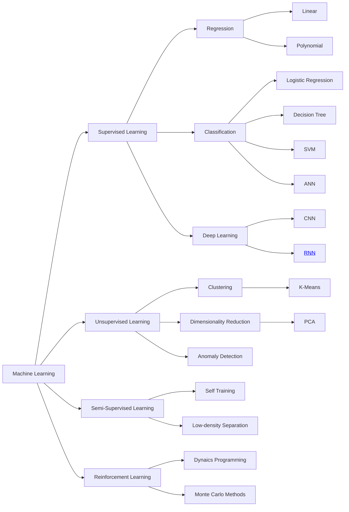

# Docs Machine Learning

Dokumentasi ini dibuat dari hasil Googling, Github AI, dan [buku](linkurl) pengenalan Machine Learning

>Kami TIDAK bertanggung-jawab atas KEAKURATAN mau pun KERUGIAN yang mungkin terjadi akibat memanfaatkan situs ini. HARAP MENANGGUNG SENDIRI SEGALA RISIKO! Jangan lupa mengungkapkan/ menuliskan penghargaan (acknowledgement) jika anda menggunakan bahan karya dari pihak lain. Situs ini berbasis “Google Sana, Google Sini, Coba Itu, Coba Ini, Lalu Tanya-tanyi” (GSGSCICILTT). Entah ini PLAGIAT, entah ini RISET, yang jelas tidak pernah ada klaim bahwa ini merupakan karya asli, serta belum tentu pula merupakan solusi terbaik, serta bukan untuk konsumsi Scopus :). Mohon kiranya memberikan tanggapan, terutama jika memiliki solusi alternatif. Semoga catatan ini akan bermanfaat di masa mendatang, saat sudah lupa cara menyelesaikan masalah trivia ini.
>
>[Rahmat M. Samik-Ibrahim](https://rms46.vlsm.org/)

# Kontribusi
Jika menemukan kesalahan dalam penulisan kata atau ingin menambahkan konten baru, silahkan buat perubahan. Anda juga bisa menggunakan tombol dibagian kanan atas di setiap artikel/konten untuk menambahkan ke pull request. Jika tidak tau apa maksudnya, anda juga bisa membuat issue atau kirim email.

#### Terima Kasih

